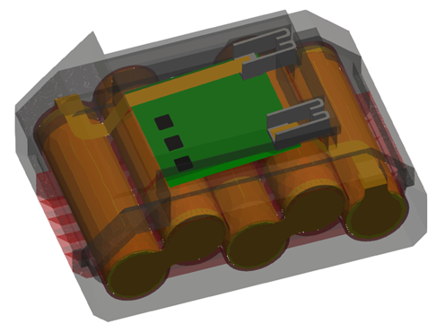
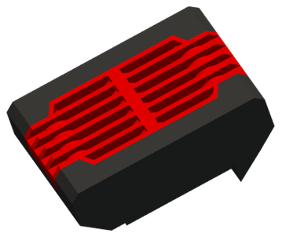
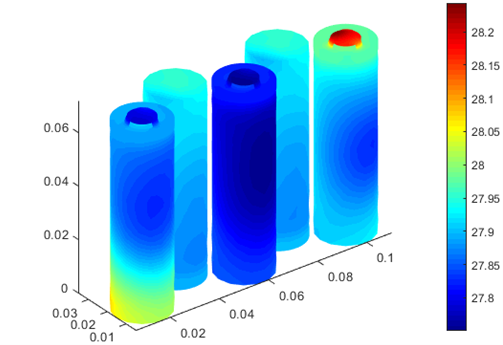
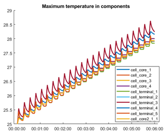
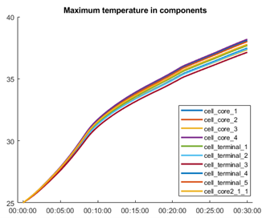
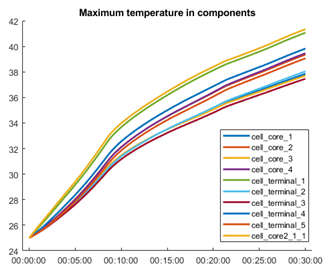

# Heat transfer in a power tool’s battery pack modeled in Q-Bat

This repository shows how to model heat transfer in a power tool’s battery pack in Q-Bat from QuickerSim. The model consists 5 Li-ion cells connected in series, terminals, connectors, holders and casing and is connected to a reduced-order model (ROM) to model heat transfer in 3D geometry.

The model will be simulated under 3 circumstances:
1.	Normal operation – Current profile consists of 24 reapeted cycles, which simulate screwing in a screw followed by a break. 360 seconds of operation in total.
2.	Rapid charging – 30 minutes of charging with constant current of 6A.
3.	Thermal propagation – One cell is heating significantly more due to malfunction. Heat dissipation from a faulty cell will be checked. 30 minutes of operation.

### :arrow_down: Please use this link instead of the download button: [Download link](https://github.com/QuickerSim/Power-tools-Q-Bat-use-case/releases/download/1.0.0/Power-tools-Q-Bat-use-case.zip) :arrow_down:

Run power_tools_demo.m or power_tools_demo_ls.mlx to get started
* Please visit the [Q-Bat](https://www.mathworks.com/products/connections/product_detail/quickersim-q-bat.html) and [QuickerSim](https://emobility.quickersim.com/) 
page to learn more about modeling heat transfer in 3-D systems.

## **Simulation Model**

## **Case 1**

## **Case 2**

## **Case 3**

